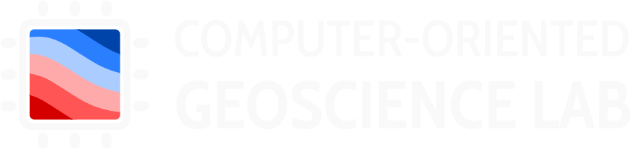

<!--
-------------------------------------------------------------------------------
This file defines the contents of each slide.
The reveal.js configuration can be found in index.html
-------------------------------------------------------------------------------
-->

<!-- .slide: class="slide-title" data-background-image="assets/title-slide.svg" data-background-color="#000000" data-background-size="contain" -->

<!-- Place the content at the bottom of the slide -->

<h1 id="talk-title">
  Magnetic fields and
   
  the flow of heat beneath
   
  Antarctica's ice sheets
</h1>

  <a href="https://www.leouieda.com" id="talk-speaker">Leonardo Uieda</a>

<!-- Place location and date side-by-side with affiliation logos -->

<i class="fa fa-calendar-alt" style="margin: 0 10px 0 0"></i>
23 November 2023

IAG Science Day 2023

<!-- Permission to reuse and CC-BY license logo -->
<i class="fa fa-camera" style="margin: 0 10px 0 0"></i>
Feel free to screenshot/share/reuse this presentation

<a href="https://creativecommons.org/licenses/by/4.0/"><i class="fab fa-creative-commons"></i><i class="fab fa-creative-commons-by" style="margin: 0 10px 0 2px"></i>CC-BY 4.0 License</a>

Background image by [Alexrk2](https://commons.wikimedia.org/wiki/File:Antarctica_relief_location_map.jpg) (CC-BY-SA)

<!-- Add logos here. Need these wrappers to align them to the bottom right -->

  
  
  

===============================================================================

<!-- .slide: data-background-image="assets/antarctica-warming.jpg" data-background-size="contain" -->

Image source: [NASA Earth Observatory](https://earthobservatory.nasa.gov/images/36736/antarctic-warming-trends) (public domain)

===============================================================================

<!-- .slide: data-background-image="assets/antarctica-heatflow-direct.jpg" data-background-size="contain" data-background-color="#000000" -->

Image source: [Burton-Johnson et al. (2020)](https://doi.org/10.5194/tc-14-3843-2020)

===============================================================================

<!-- .slide: class="slide-transition" -->

# Enter Geophysics

===============================================================================

<!-- .slide: data-background-image="assets/antarctica-magnetic-data.jpg" data-background-size="contain" -->

Image source: India Uppal (CC-BY)
 
From APMAP2 data ([Golynsky et al., 2018](https://doi.org/10.1029/2018GL078153))

===============================================================================

<!-- .element: class="fragment" data-fragment-index="1" --> Magnetic data

<!-- .element: class="fragment" data-fragment-index="2" --> 
<i class="fas fa-arrow-alt-circle-down" style="color: #0053d1"></i> 
 
Depth of sources1

<!-- .element: class="fragment" data-fragment-index="3" --> 
<i class="fas fa-arrow-alt-circle-down" style="color: #0053d1"></i> 
 
Depth of 580°C isotherm2

<!-- .element: class="fragment" data-fragment-index="4" --> 
<i class="fas fa-arrow-alt-circle-down" style="color: #0053d1"></i> 
 
<strong>Surface heat flow</strong>3

1 Assuming homogenous and induced-only magnetization.
 
2 Assuming the magnetic minerals are magnetite.
 
3 Assuming homogeneous thermal conductivity.

===============================================================================

<!-- .slide: data-background-image="assets/magnetic-spectrum-method-window.svg" data-background-size="contain" -->

Image source: [Burton-Johnson et al. (2020)](https://doi.org/10.5194/tc-14-3843-2020)

===============================================================================

<!-- .slide: data-background-image="assets/magnetic-spectrum-method-full.svg" data-background-size="contain" -->

Image source: [Burton-Johnson et al. (2020)](https://doi.org/10.5194/tc-14-3843-2020)

===============================================================================

<!-- .slide: class="slide-transition" -->

# Issues

===============================================================================

<!-- .slide: data-background-image="assets/heatflow-model-comparison.svg" data-background-size="contain" -->

Image modified from: [Lösing et al. (2020)](https://doi.org/10.3389/feart.2020.00105)

===============================================================================

Spectral methods

are **outdated**

[Audet & Gosselin (2019)](https://doi.org/10.1093/gji/ggz166) |
[Núñez Demarco et al. (2021)](https://doi.org/10.1093/gji/ggaa361) |
[Szwillus et al. (2022)](https://doi.org/10.1093/gji/ggac133)

===============================================================================

Ex: [Martos et al., (2017)](https://doi.org/10.1002/2017GL075609), 
[Kim et al. (2022)](https://doi.org/10.1029/2021JB023329) 

Right image modified from: [Fox Maule et al. (2005)](https://doi.org/10.1126/science.1106888)

===============================================================================

<!-- .slide: class="slide-transition" -->

What we're working on:

Data merger + Depth estimation

===============================================================================

**Equivalent sources**

From **~50k** data in **days** on  <i class="fas fa-server"></i> <i class="fas fa-server"></i> 

to **~10G** data in **hours** on <i class="fas fa-laptop"></i>

===============================================================================

From the BSc dissertation of Hamed Rashid Hamed Alsalehi (2022)

===============================================================================

From the BSc dissertation of Hamed Rashid Hamed Alsalehi (2022)

===============================================================================

<!-- .slide: data-background-image="assets/india-results.svg" data-background-size="contain" -->

From the poster presentation: [Uppal et al. (2023)](https://www.compgeolab.org/news/pgr-conference2023.html)

===============================================================================

# **End goals**

1. <!-- .element: class="fragment" --> New merged Antartic magnetic <strong>data</strong> 
1. <!-- .element: class="fragment" --> Updated inference <strong>method</strong> for heat flow
1. <!-- .element: class="fragment" --> Open-source <strong>software</strong> for all of this
1. <!-- .element: class="fragment" --> <strong>Applications</strong> to other continents

===============================================================================

# **This is the hard work of**

## Santiago Soler 

(former PhD)

## India Uppal 

(current PhD)

## Hamed Alsalehi 

(former BSc)

===============================================================================

<!-- .slide: class="slide-contact" data-background-image="assets/contact-slide.svg" data-background-size="contain" data-background-color="#000000" -->

<i class="fas fa-comments"></i>
 
Contact:
<a href="https://www.leouieda.com">www.leouieda.com</a>

<i class="fab fa-github"></i>
 
Source code for this presentation:
 
[github.com/leouieda/iag-science-day-2023](https://github.com/leouieda/iag-science-day-2023)

<i class="fab fa-creative-commons"></i><i class="fab fa-creative-commons-by"></i>
 
Unless otherwise noted,
the contents of this presentation are
licensed under the
 
[Creative Commons Attribution 4.0 International License](https://creativecommons.org/licenses/by/4.0/).

The background image is a Landsat 9 scene of the city of São Paulo, Brazil,
showing the USP campus in the center.

